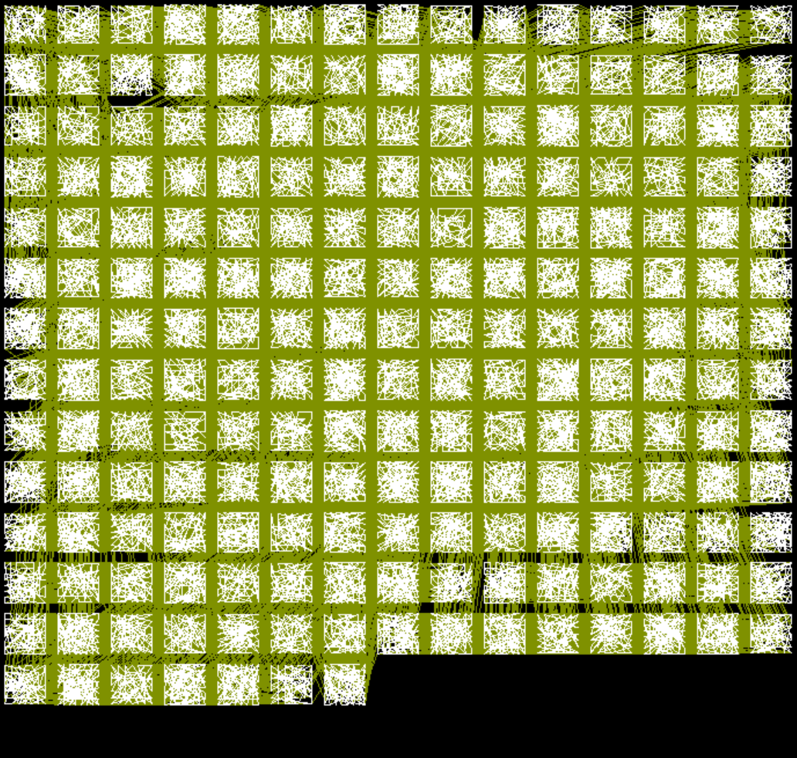

# AlgAndComplexity

算法与复杂性 Lab 和 Project

课程结果差强人意，但不论如何，从这门课上进阶了 LaTeX，也算是一些收获吧。该门课程提供了这样的机会。

1. [**Lab00**](Lab00/Lab00.pdf) 使用了 `tikzmark` 在文档中标记箭头。
2. [**Lab01**](Lab01/Lab01.pdf) `minted` 代码高亮包的使用（不太稳定），使用 [PGFPlotsEdt](https://logcreative.github.io/PGFPlotsEdt/?lang=cn) 绘制原生统计图。
3. [**Lab02**](Lab02/Lab02.pdf) [递归树](Lab02/img/Fig-RecurrenceTree.tex)的原生绘制。
4. [**Lab03**](Lab03/Lab03.pdf) [重叠圈](Lab03/img/twoover.tex)的原生绘制。 
5. [**Lab04**](Lab04/Lab04.pdf) 表格上色。
6. [**Lab05**](Lab05/Lab05.pdf) 使用 `foreach` 生成[遍历图](Lab05/img/tc.tex)。  
7. [**Lab06**](Lab06/Lab06.pdf) 使用 `input` 指令关联文本文件输出结果。
8. [**Lab07**](Lab07/Lab07.pdf) [仿佛能听到钱花掉的声音](Lab07/img/p1.tex) 
9. [**Lab08**](Lab08/Lab08.pdf) 使用 [GraphGenDecomp](https://github.com/LogCreative/GraphGenDecomp) 可视化强连通分量。
10. [**Lab09**](Lab09/Lab09.pdf) [分裂节点](Lab09/img/dirsplit.tex)  
11. [**Lab10**](Lab10/Lab10.pdf) [状态转移图](Lab10/tmtd.tex) 
12. [**Lab11**](Lab11/Lab11.pdf) 有彩蛋的源码。
13. [**Project**](Project/beamer/beamer.pdf) 使用了 [SJTUBeamermin](https://github.com/LogCreative/SJTUBeamermin) 模板的 [Project Presentation](Project/beamer/beamer.tex)，使用 [Python 代码](Project/code/toydata.ipynb) 生成 `tikz` 绘图命令以异步可视化数据。
14. [**review**](review/cheatsheet.pdf) 使用了 `tcolorbox` 规整知识卡片。